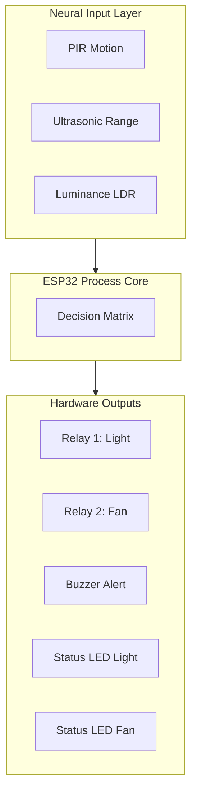

# 🛠️ Master Wiring Guide - Secure IoT Home "Perfect" Edition

Follow this guide for a professional-grade hardware assembly. This system is optimized for the **ESP32 DevKit V1 (30-pin)**.

> [!IMPORTANT]
> This guide is synced with the latest **v2.0 Firmware**. Ensure your pins match exactly for the code to function correctly.

## 📌 Master Pinout Table

| Component | Pin Label | GPIO No. | Type | Function |
| :--- | :--- | :--- | :--- | :--- |
| **Relay 1** | **D5** | 5 | Output | Smart Light Power (Active Low) |
| **Relay 2** | **D4** | 4 | Output | Smart Fan Power (Active Low) |
| **PIR Sensor** | **D18** | 18 | Input | Neural Motion Detection |
| **LDR Sensor** | **D34** | 34 | Analog | Ambient Light Lux Sampling |
| **US TRIG** | **D13** | 13 | Output | Ultrasonic Pulse Trigger |
| **US ECHO** | **D12** | 12 | Input | Ultrasonic Echo Return |
| **Buzzer** | **D21** | 21 | Output | Haptic/Audio Feedback Alert |
| **LED Light** | **D22** | 22 | Output | Visual Feedback: Light Status |
| **LED Fan** | **D23** | 23 | Output | Visual Feedback: Fan Status |

---

## ⚡ Power Topology

1.  **Primary Power**: Connect ESP32 via **USB-C/Micro-USB** (5V).
2.  **Peripherals (5V)**: Use the **VIN** pin to power:
    *   2-Channel Relay Module
    *   HC-SR04 Ultrasonic Sensor
    *   HC-SR501 PIR Sensor
3.  **Peripherals (3.3V)**: Use the **3V3** pin for the LDR Voltage Divider.
4.  **Grounding**: Connect all **GND** pins to a common ground rail.

---

## 🧩 Component Wiring Details

### 1. Relays (Active Low)
*   **VCC** ➡ VIN (5V)
*   **GND** ➡ GND
*   **IN1** ➡ D5
*   **IN2** ➡ D4

### 2. Motion & Range Sensors
*   **US TRIG** ➡ D13 | **ECHO** ➡ D12
*   **PIR OUT** ➡ D18

### 3. Visual Indicators (LEDs)
*   **Light Indicator (+)** ➡ D22 ➡ 220Ω Resistor ➡ LED ➡ GND
*   **Fan Indicator (+)** ➡ D23 ➡ 220Ω Resistor ➡ LED ➡ GND

---

## 📐 System Logic Flow

---

## ✅ Pre-Flight Checklist
- [ ] **Voltage Verification**: Relays are powered by **5V (VIN)**, NOT 3.3V.
- [ ] **Resistor Check**: Ensure 220Ω resistors are used for LEDs to prevent burnout.
- [ ] **LDR Divider**: 10kΩ resistor is correctly pulled to GND for LDR sampling.

---

> [!CAUTION]
> **HIGH VOLTAGE WARNING**: RELAY CONNECTIONS TO AC MAINS (110V/220V) ARE DANGEROUS. ALWAYS DISCONNECT POWER BEFORE WIRING THE AC SIDE.
